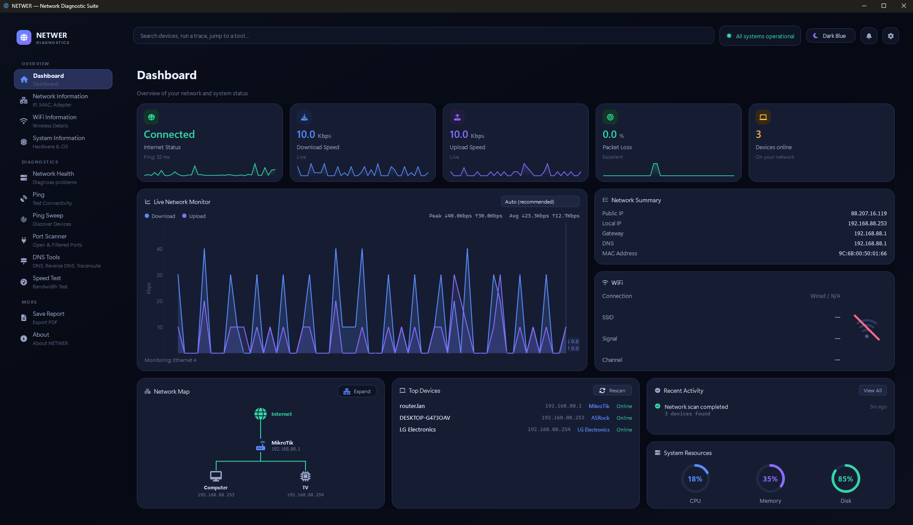
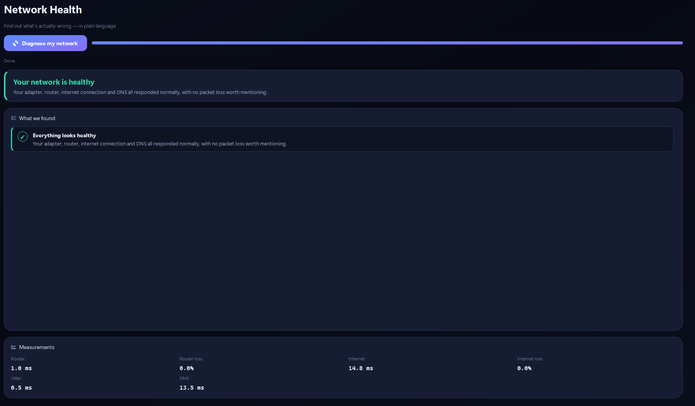
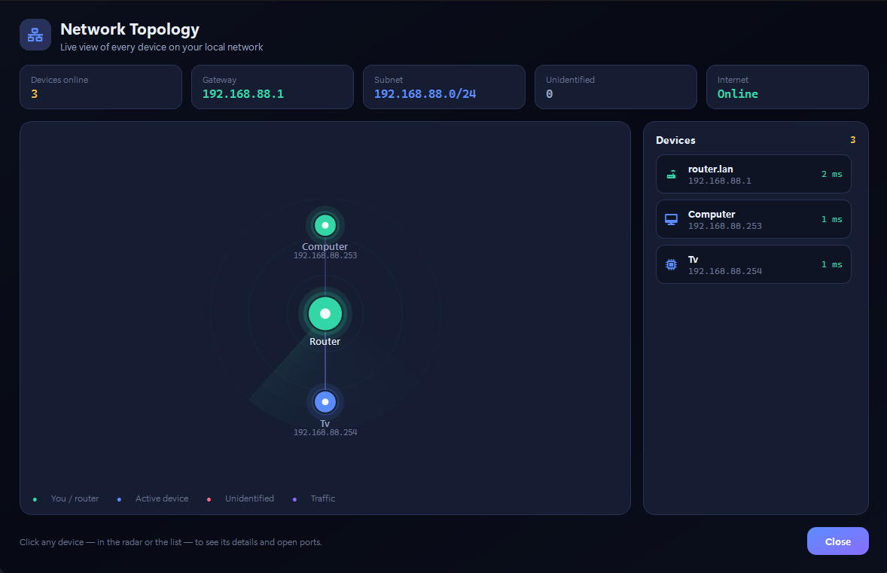

<p align="center">
  
</p>

# Netwer - Network Diagnostic Suite


**Features  Screenshots  Installation  Project Structure  Roadmap**


## About the Project

NETWER is a free desktop application for network monitoring and diagnostics, built with **Python 3.13** and a modern **PyQt6** interface.

It is designed as an all-in-one alternative to tools like **GlassWire**, **Fing**, and parts of **Wireshark's** functionality — without subscriptions, advertisements, or unnecessary complexity.

Instead of simply displaying network statistics, NETWER tries to answer the question users actually have:

It explains network issues in plain English instead of showing only latency numbers and technical logs.


## Features

### Live Network Monitoring

* Real-time dashboard with internet status, bandwidth usage, packet loss, and connected device count.
* Live upload/download traffic graphs.
* Animated **Network Radar** where devices pulse and traffic flows across connections.

### Device Discovery & Identification

* **Ping Sweep** scans the entire local subnet in parallel using 64 worker threads.
* Detects device manufacturers using an offline OUI database with 900+ entries.
* mDNS/Bonjour discovery identifies devices such as iPhones by their hostname even when MAC randomization is enabled.
* Self-learning device database remembers corrected vendors and device names permanently, completely offline.
* Assign custom names (for example *Mom's Laptop*) that follow devices by MAC address.

### Network Diagnostics

* **Network Health** performs a complete connectivity diagnosis with a single click:

  * Network adapter
  * Wi-Fi connection
  * Router
  * Internet connectivity
  * DNS resolution
* Pinpoints **where** the problem is instead of only reporting that something failed.
* Includes Ping, Traceroute, Reverse DNS lookup, and a Port Scanner.

### Reports & Utilities

* Export detailed PDF network health reports.
* Export discovered devices to CSV.
* Built-in internet speed test.
* Automatic UI scaling for different screen resolutions.
* Five built-in themes plus customizable accent colors.

## Screenshots

### Dashboard

*Everything important in one place.*

<p align="center">
  
</p>

### Network Health

*Human-readable network diagnostics.*

<p align="center">
  
</p>

### Network Radar

*Animated visualization of your local network topology.*

<p align="center">
  
</p>

## Technologies

| Layer                 | Technology               |
| --------------------- | ------------------------ |
| Language              | Python 3.13              |
| User Interface        | PyQt6                    |
| Charts                | PyQtGraph                |
| System Information    | psutil                   |
| Icons                 | QtAwesome (Font Awesome) |
| PDF Reports           | ReportLab                |
| 3D Globe (About Page) | QtQuick3D / QML          |
| Networking            | `socket`, `subprocess`   |
| Background Workers    | `QThread`                |
| Testing               | `unittest`               |

## Installation

```bash
git clone https://github.com/lukashajni/Netwer.git
cd Netwer

pip install -r requirements.txt
python main.py
```

> Developed and tested on **Windows 11** and **Pop!_OS**.
>
> Some features (network adapter details, Wi-Fi information, ARP table, and diagnostics) rely on Windows utilities such as `ipconfig`, `netsh`, and `arp`, making Windows the recommended platform.

## Project Structure

```text
NETWER/
├── main.py                 # Application entry point
├── core/                   # Networking and diagnostic logic
│   ├── netwer_core.py
│   ├── diagnostics.py       # Network Health engine
│   ├── vendor_learning.py
│   └── device_fingerprint.py
├── ui/
│   ├── pages/              # 12 application pages
│   ├── widgets/            # Radar, graphs, gauges, cards
│   └── components/         # Sidebar, topbar, dialogs, settings
├── app/                   # Themes, settings, resolution handling
├── workers/               # Background workers
├── docs/
    ├── screenshots        
├── reports/               # PDF report generation
└── tests/                 # Automated tests
```

**Project size**

* ~18,700 lines of Python code.
* 76 Python files.
* 12 application pages.
* Modular architecture with background workers and reusable widgets.

## Testing

Run the automated test suite:

```bash
python -m unittest tests.test_core -v
```

**114 automated tests** cover:

* Network core logic.
* Device fingerprinting.
* Self-learning vendor database.
* Diagnostic reasoning engine.
* UI stability.

Tests can run independently without launching the full application.

## Roadmap

* [ ] Windows `.exe` installer (PyInstaller).
* [ ] Background monitoring with System Tray support and historical statistics.
* [ ] Threat Radar for suspicious devices and ARP spoofing detection.
* [ ] Wi-Fi channel analyzer.
* [ ] DNS benchmark against public DNS resolvers.


## Contributing

Pull requests are welcome.

For major changes, please open an Issue first so we can discuss the proposed direction before implementation.


## License

This project is licensed under the **MIT License**. See the `LICENSE` file for details.


## Netwer Team

**Lukas Hajneman |**
**Jan Sven Bukovski |**
**Erik Celjak**
